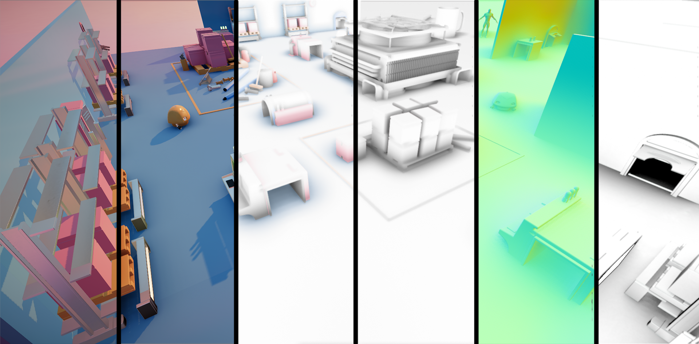

;
# Unity3D Ground Truth Ambient Occlusion
## Introduction:
### Ground Truth Ambient Occlusion use screen space pixel infos to generate occlusion map for indirect light, Simply drag the script component onto your target Camera. The occlusion effect could make you scene looks darker, make sure you are using the appropriate intensity and range.

## Features:
* Based on Unity commandBuffer, easy to fit in Scriptable Rendering Pipeline.
* Slightly better than HBAO+
* Use Temporal Filter to reduce performance cost and increase quality.
*  Physically based AO.
* Support indirect diffuse & specular occlusion.

## Limitations:
* Physically based rendering requiring screen space geometry buffer: Depth, Normal, Specular, roughness, etc..
* Currently still using legacy rendering pipeline.
* Temporal filter requiring motion vector map.